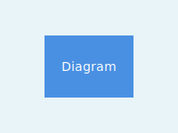

# Getting Started

Welcome! This section covers everything you need to know to get started with Silverstripe CMS.

## Overview

Here's what you'll need to know:

[CHILDREN includeFolders]

## What You'll Learn

- Installation and setup
- Basic concepts
- Advanced installation options
- Development workflow

## Architecture Diagram

This diagram shows how the main components interact with each other.
